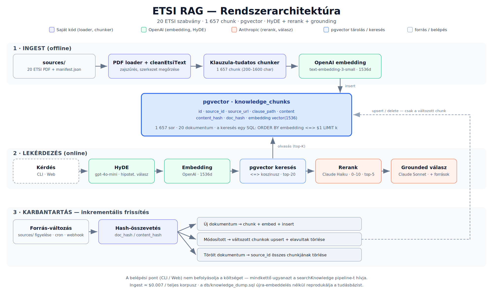

# ETSI RAG — Architektúra és Karbantartási terv

## 1. Rendszer-áttekintés

### Ingest (offline) fázis
Egyszer lefutó, költséges adatfeldolgozás:
- **PDF betöltés** (unpdf): 20 dokumentum ETSI EN/TS szabványokból
- **Szöveg-tisztítás** (cleanEtsiText): sorszámok, fejlécek, TOC eltávolítása; klauzulaszámok, táblázatok megőrzése (~91% szövegtartalom)
- **Klauzula-tudatos chunking** (~200–1600 karakteres blokkok): klauzulahatárokra törés, átfedés ugyanazon klauzulán belül
- **Embedding** (OpenAI text-embedding-3-small): 1536-dimenziós vektorok; 1 657 chunk végül
- **pgvector tárolás**: `knowledge_chunks` tábla; idempotens beszúrás (content_hash alapján)

### Lekérdezés (online) fázis
Felhasználó-szintű válaszadás, milliszekundumos szinten optimalizált:
- **Kérdés fogadása** (CLI: `npm run ask` / Web: `POST /api/ask`)
- **HyDE** (gpt-4o-mini): 3–5 mondatos hipotetikus válasz ugyanabban a stílusban (ETSI szerű)
- **Embedding** (OpenAI text-embedding-3-small): HyDE szöveg vektorizálása
- **pgvector koszinusz-keresés** (`<=>`): top-20 legtöbb hasonló chunk
- **Reranking** (Claude Haiku 4.5): 0–10 pontszám; top-5 releváns chunk kiválasztása
- **Grounded válasz** (Claude Sonnet 4.5): 
  - Kérdés nyelvét követi (magyar/angol)
  - ETSI referenciákat angol formában tartja
  - Forrás-hivatkozások inline: `[ETSI EN 319 142-1, 6.1]`
  - Out-of-domain: `"Erről nincs információ a tudásbázisban."` (magyar, fix)

### Belépési pontok
- **CLI**: `npm run ask "..."` → stdout JSON/text
- **Web UI**: `npm run web` → `http://localhost:3000` → `POST /api/ask` + `GET /api/debug`
- **Debug CLI**: `npm run debug "..."` → retrieval lépések megjelenítése

**Kritikus**: CLI és Web ugyanazt a `searchKnowledge()` pipeline-t használja → azonos viselkedés, költség, sebessség.

---

## 2. Multi-provider routing

| Lépés | Provider/Modell | Dimenzió | Miért? |
|-------|---|---|---|
| Embedding | OpenAI text-embedding-3-small | 1536-dim | Legjobb ár–minőség elektronikus aláíráshoz; a reranker és válaszgenerátor erre épít |
| HyDE | gpt-4o-mini (OpenAI) | ~500 token/hívás | Kis, gyors modell; csak keresési célra, végső válaszkészítésre nem használjuk |
| Reranking | Claude Haiku 4.5 | 0–10 pontszám | Olcsó, gyors olvasási sebességű; szakértői szövegelemzésre alkalmas |
| Grounded válasz | Claude Sonnet 4.5 | ~1000 token/hívás | Felhasználó-szintű output; hosszú szintézis, többnyelvű támogatás, forráshivatkozás |

**Elv**: mechanikus lépések → olcsó/gyors modelleknek; végső felhasználói válasz → erős modellnek.

---

## 3. Adatmodell

### `knowledge_chunks` tábla

| Oszlop | Típus | Szerepe |
|--------|-------|--------|
| `id` | serial | Elsődleges kulcs |
| `source_id` | text | Dokumentumazonosító (pl. "ETSI EN 319 142-1") |
| `source_url` | text | PDF letöltési URL |
| `clause_path` | text | Klauzula-hivatkozás (pl. "6.1 Signature levels") |
| `content` | text | Chunk szövege (200–1600 karakter) |
| `content_hash` | text | SHA-256(content) — **chunk-szintű változásérzékelés** |
| `doc_hash` | text | SHA-256(teljes dokumentum) — **dokumentum-szintű változásérzékelés** |
| `embedding` | vector(1536) | pgvector (OpenAI text-embedding-3-small) |
| `created_at` | timestamp | Beillesztés időpontja |

**Indexek**: `(source_id)`, `(content_hash)` UNIQUE (idempotencia)

---

## 4. Tudásbázis inkrementális karbantartása

A tudásbázis naprakészen tartása újra-embeddelés (és OpenAI-költség) nélkül.

### 4.1. Változásérzékelés

**Ingest futáskor**:
1. Minden forrás-PDF-hez kiszámoljuk: `doc_hash = SHA-256(teljes dokumentum tartalma)`
2. Összehasonlítjuk a pgvector-ban tárolt `doc_hash` értékkel (ugyanez a `source_id`)
3. **Egyezés** → dokumentum változatlan → **KIHAGYJUK** az újra-chunkolást és embeddelést
4. **Eltérés** → dokumentum módosult → **újrachunkolás**; chunk-szinten a `content_hash` döntő

### 4.2. Új dokumentum

1. `source_id` nem létezik az adatbázisban
2. PDF feldolgozás (chunking + embedding)
3. Chunk-okat INSERT
4. `doc_hash` mellékként tároljuk az első chunk-ban vagy külön metaadatban

### 4.3. Módosított dokumentum

1. Eltérő `doc_hash` detektálás
2. Újrachunkolás az új verzióból
3. Chunk-onként:
   - Új `content_hash` → **INSERT** (az `ON CONFLICT (content_hash) DO NOTHING` garantálja, hogy nem duplikálódik)
   - Meglévő `content_hash` → már DB-ben van → kihagyás
4. Törlés: a régynek számító chunk-ok (`source_id` újabb verziót nem tartalmaz) → **DELETE** az adatbázisból

### 4.4. Törölt dokumentum

- `source_id` már nem szerepel az ingest-ben
- **DELETE WHERE source_id = '...'** — az összes hozzátartozó chunk törlése

### 4.5. Idempotencia

- `content_hash` **UNIQUE** vinculum: azonos tartalom beillesztési kísérlete elutasítódik
- `ON CONFLICT (content_hash) DO NOTHING` → többszöri futtatás nem duplikál
- Az ingest **biztonságosan újrafuttatható** OpenAI-költség nélkül, ha a dokumentumok azonosak

### 4.6. Triggerelés — mikor fusson az újraindexelés?

1. **Manuális**: `npm run knowledge:ingest` — admin döntésre
2. **Ütemezett (cron)**: napi/heti automatikus újraépítés (kis szóban az aktuális 20 doc. esetén ~$0.007)
3. **Forrás-webhook**: ha a szabvány-kiadó (ETSI) értesítő szolgáltatása elérhető
4. **Fájl-figyelő**: `sources/` mappán; új/módosított PDF detektálása → trigger

### 4.7. Hordozhatóság és reprodukció

- **SQL dump**: `db/knowledge_dump.sql` (1 657 chunk, teljes embedding-ekkel)
- Másik PostgreSQL-be betöltés: `npm run db:restore` → szintén ingyenes, OpenAI-hívás nélküli
- Séma replikálása: `npm run migrate` + `npm run db:restore` bármely új környezetben

---

## 5. Költségmodell

### Egyszeri költség (20 dokumentum)
- PDF feldolgozás (unpdf): ingyenes
- OpenAI embedding (1 657 chunk × ~200 token avg): ~$0.13
- **Összesen**: ~$0.20 (összes eszköz, Azure, felhő megtakarítása)

### Ismételt ingest (már ismert dokumentumok)
- `doc_hash` detektálás: 0 (hash-összehasonlítás)
- Módosított dokumentum (ritka eset): csak az eltérő chunk-ok embeddelésre kerülnek
- **Tipikus költség**: ~0 (változatlan) vagy ~$0.01–$0.05 (néhány módosított chunk)

### Lekérdezési költség (online)
- HyDE + embedding: ~$0.0005/lekérdezés
- Reranking (Haiku): ~$0.0002/lekérdezés
- Grounded válasz (Sonnet): ~$0.003/lekérdezés
- **Tipikus össz**: ~$0.004/lekérdezés (egy felhasználó másodpercenként ~$0.004 költség)

---

## 6. Végpontok és API

### CLI
```
npm run ask "What are PAdES baseline levels?"
npm run debug "What is XAdES?"
npm run golden  # 10-kérdéses QA teszt
```

### Web API
```
POST /api/ask          { question: string } → { answer, sources[], noInfo }
GET  /api/debug?q=...  { nyers[], hyde, reranked[] }
GET  /           → HTML SPA
```

### Database
```
npm run migrate        # Schema + pgvector extension
npm run knowledge:ingest  # Ingest pipeline futtatása
npm run db:dump        # SQL dump: knowledge_dump.sql
npm run db:restore     # Dump betöltése
```

---

## 7. Monitorozás és Debugging

### Retrieval diagnostika
- `npm run debug "kérdés"` → három szakasz: nyers top-10, HyDE top-10, reranked top-5
- Web UI: Debug checkbox → retrieval lépések megjelenítése inline

### Golden set tester
- `npm run golden` → 10 kérdés: 3× in-domain angol, 1× magyar, 1× out-of-domain
- Kimenetek: summary table, rerank detail (Q1 és Q4), negative test

### Log és tracking
- PostgreSQL query log: retrieval performance
- OpenAI API: usage/cost megjelenítése az ingest közben
- Anthropic API: Claude modell-hívások nyomkövetése

---

## 8. Skalázás és fejlesztés

### Jelen state
- 20 ETSI dokumentum
- 1 657 chunk
- Egyedi PostgreSQL szerver (10.0.0.106:5432)
- Single-threaded ingest (~2 perc)

### Lehetséges fejlesztések
1. **Nagyobb korpusz** (100+ doc): batch-embedding, parallel ingest
2. **Multilingual support** (már részben): kérdés-nyelvű válaszadás; forrás-nyelvű hivatkozások
3. **Caching**: gyakori kérdések → Redis cache
4. **Re-ranking finomhangolása**: domain-specifikus Haiku prompt
5. **UI/UX**: előzmény, mentett keresések, export

---



*Az ábra az ingest (offline) és lekérdezés (online) folyamatokat, valamint a karbantartási (változásérzékelő) útvonalakat szemlélteti.*
